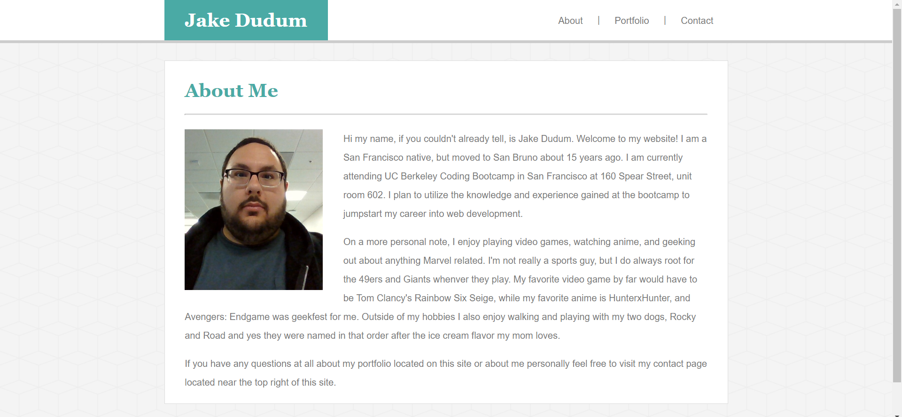
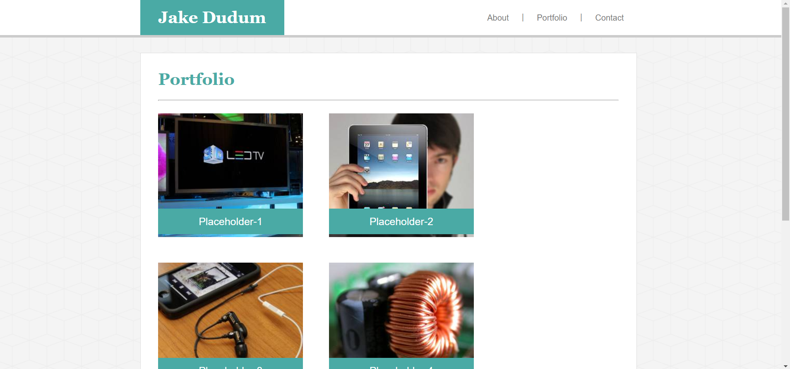
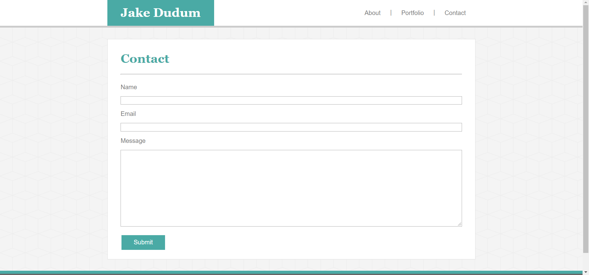

# Bootstrap-Portfolio

A carbon copy of my [Basic-Portfolio](https://jakedudum.github.io/Basic-Portfolio/), but made more responsive through the use of [Bootstrap](https://getbootstrap.com/) and its [grid system](https://getbootstrap.com/docs/4.3/layout/grid/).

# Link to Deployed Site
- [Bootstrap-Portfolio](https://jakedudum.github.io/Bootstrap-Portfolio/)

# Built With
- [HTML](https://developer.mozilla.org/en-US/docs/Learn/HTML)
- [CSS](https://developer.mozilla.org/en-US/docs/Web/CSS)
- [Bootstrap](https://getbootstrap.com/)

# Versioning
- [Github](https://github.com/)

# Authors
### Jake Dudum

# Acknowledgments
- Darryl Tolentino for inspiration and idea bouncing